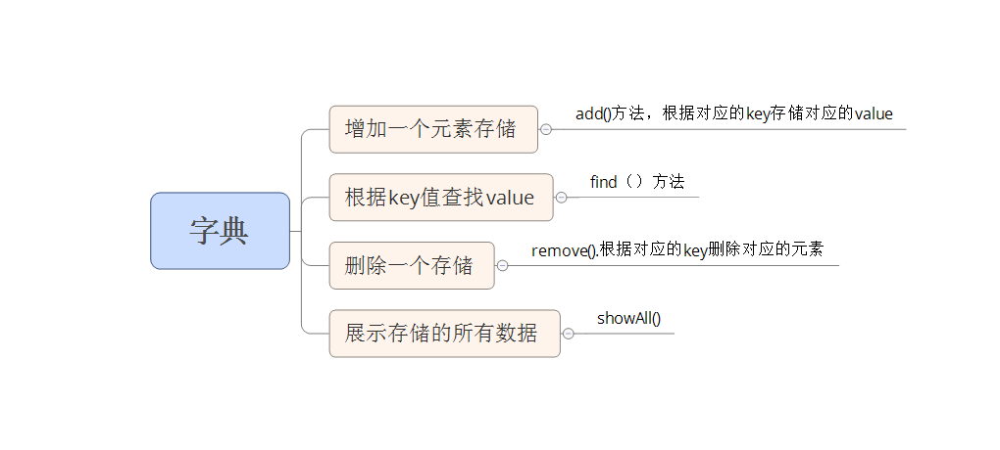

#字典
###基本特征和概念
		注:js中的object类的设计就是以字典的形式设计的。
		具体实现原理：字典类的基础是Array类，因为数组也是一个对象。通过对键值对中键值存储为数组下标，值存储为对应下标的值来实现。
		优点：以键值对来存储在数组中的一种数据结构，可以实现尽快的根据key值来找到value值

###字典的数据结构
		

###注意点
		虽然我们操作的字典是基于数组的，还是与数组还是有很大的区别的。
		1：数组的索引值是以整数存储，但是字典中，利用数组是对象，将key值作为数组来存储，所以会限制我们使用length来获取数组datastore中的元素个数
		2：Object.keys是遍历对象中可枚举的属性和方法，其返回值是一个数组，里面存储可枚举的方法名和属性名

