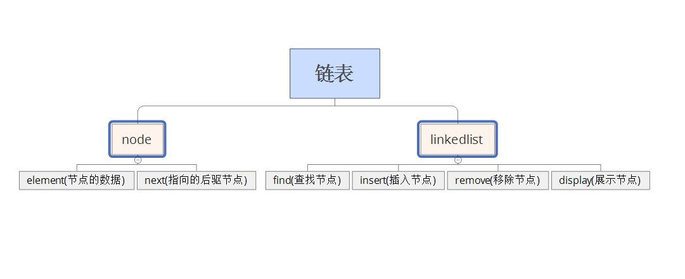
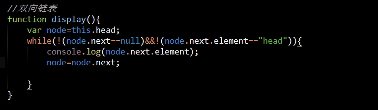

#链表
###问题：
		问题一：数组的缺点是：数组被实现成了对象，与其他语言的数组相比，效率很低。在某些情况下使用很慢，所以考虑使用链表来替代。在实际操作中，遍历链表进行增删改查和与数组实现这一操作，数组的缺点具体表现在哪里？

		问题二： 书上实现循环链表的时候将头节点的next属性指向本身，head.next=head;可以实现的是，将传入链表中的每一个节点的next属性都指向链表的头节点，从而实现了将最后一个节点的next属性指向头节点，形成了一个循环链表。是否有更好的解决方式？这样不会导致next指针混乱吗？不是特别明白这种实现方式？

###链表的定义
		链表的实现是由一组节点组成的集合。每个节点都使用一个对象的引用指向它的后继。形成的就叫链。
###链表的数据结构分析

###循环链表
		将链表的最后一个节点的next指向head节点
		实现的功能是：可以不用付出额外的代价创建双向链表，还可以实现倒序遍历链表

###双向链表
		概念：每一个节点除了有next指针以外，还有一个pre指针，指向其前一个节点（当然head的pre指针为null）
		好处：更好的查找每个节点的前一个节点，在删除节点等操作中无需遍历整个链表。

