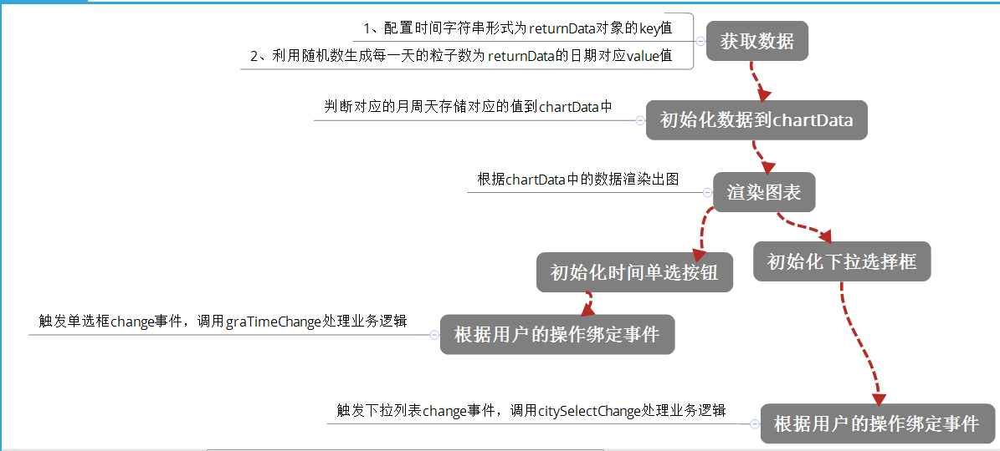

#task17
###主要实现两个功能：
		1、提供按单选框查询月周日的粒子数
		2、提供按下拉列表查询不同地区的粒子数

####补充的知识点
>其一：求一个对象里面属性的长度
>>求一个对象中枚举属性采用Object.keys(对象名).length;
>>>Object.keys()返回的是包含属性和方法的名字的数组
>>求一个对象中可枚举和不可枚举的属性采用Object.getOwnPropertyName()
		
>其二：随机数生成一个颜色值
>>颜色的三种表示法:1、16进制；2、英文字母；3、rgba()
>>>利用第一种表示方法
>>>>'#' + Math.floor(Math.random() * 0xFFFFFF).toString(16);

>其三：对于flex布局的巧妙应用
>>设置align-items:flex-end可以实现低端对齐，
>>设置justify-content:middle可以实现居中对齐
>>设置容器节点的flex：1可以实现将剩余的宽度平分

####未解决的问题
#####其一
		在渲染图表的时候，每一个div的width和margin-right是有包裹层的clientWidth等比例分配的。但是当单选框为日的时候，前面会有一大段空白，不知是怎么留出来的

		解：因为在给每个分配到的div的width和margin-right的值做了向下去整留出来的。
#####其二
		在渲染图表的时候，每个div的title属性不知为什么无效
		解：title不是无效，它显示是在element上停留几秒才会显示效果，不与hover来的快
#####其三
		利用前面随机数方法生成颜色，某些颜色值无效，理论上是不存在的，不知实践为什么存在
		解：随机数产生的值是0到1，当然可能是0.001所以就会产生的值为五位数，或者四位数，
		解决办法，加if判断取值或者给字符串替换

####还需完善的地方
		可以给渲染图表加上动画效果，使得效果可以更好
		利用css3的transition特性，但是问题是设置了transition:height 1s ease-in;以后，怎么触发这个动画呢