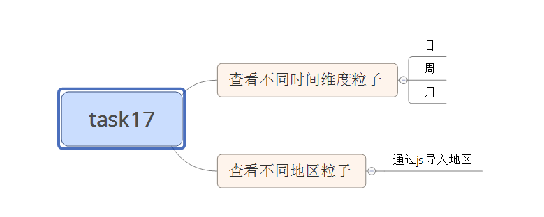

#task17
###主要实现两个功能：
		1、提供按单选框查询月周日的粒子数
		2、提供按下拉列表查询不同地区的粒子数

####补充的知识点
>其一：求一个对象里面属性的长度
>>求一个对象中枚举属性采用Object.keys(对象名).length;
>>>Object.keys()返回的是包含属性和方法的名字的数组
>>求一个对象中可枚举和不可枚举的属性采用Object.getOwnPropertyName()
		
>其二：随机数生成一个颜色值
>>颜色的三种表示法:1、16进制；2、英文字母；3、rgba()
>>>利用第一种表示方法
>>>>'#' + Math.floor(Math.random() * 0xFFFFFF).toString(16);

####为解决的问题
#####其一
		在渲染图表的时候，每一个div的width和margin-right是有包裹层的clientWidth等比例分配的。但是当单选框为日的时候，前面会有一大段空白，不知是怎么留出来的
#####其二
		在渲染图表的时候，每个div的title属性不知为什么无效
#####其三
		利用前面随机数方法生成颜色，某些颜色值无效，理论上是不存在的，不知实践为什么存在

####还需完善的地方
		可以给渲染图表加上动画效果，使得效果可以更好