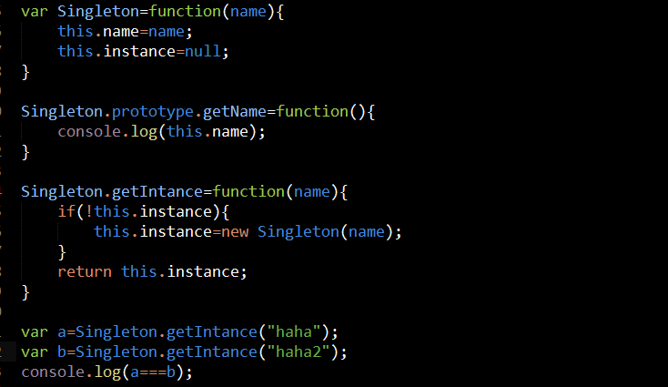
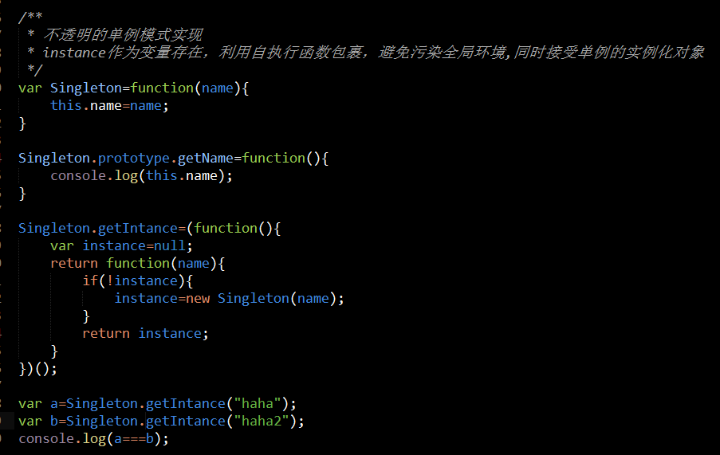
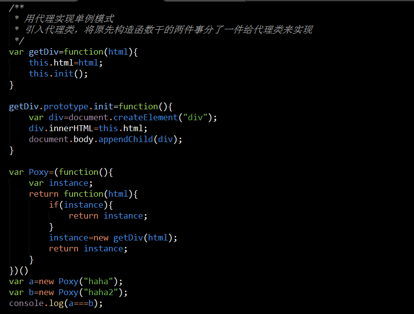
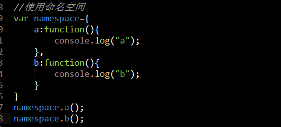
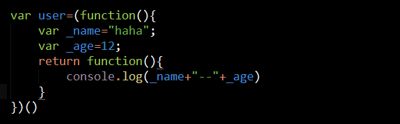
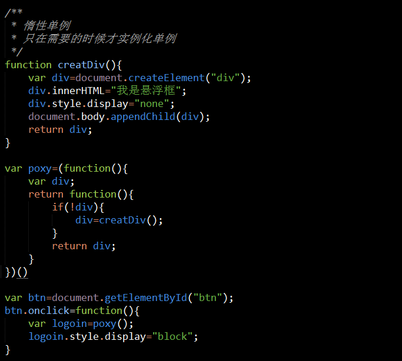
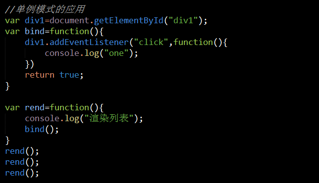
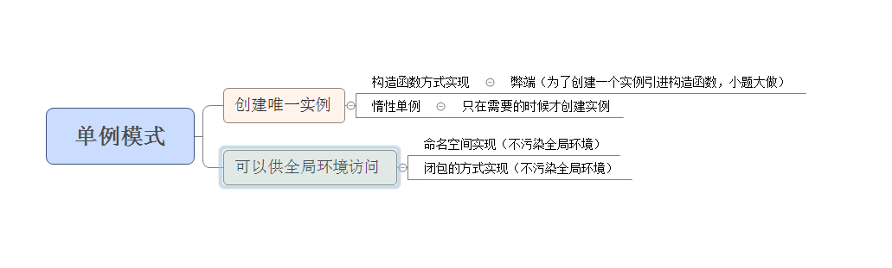

#单例模式
###单例模式的特点
		1、只有一个实例
		2、提供一个供全局访问的接口

####不透明的单例模式
		方法一：将判断是否已经创建过实例的逻辑作为构造函数的属性instance存在

		方法二：利用自执行函数和闭包的原理，将判断是否实例化对象作为自执行函数中的变量存在

####透明的单例模式
		所谓透明的单例模式是指可以用实例化普通对象的方式new出一个实例
		注意：让一个方法实现一层逻辑，遵循单一职责原则

###补充一
		如果为了实现单例模式，只单单创建一个实例就利用构造函数来实现，有点小题大做
		所以在实际中，为了实现一个实例，并在全局中可以调用,并且不污染全局环境

####方案一(命名空间)

####方案二(闭包)

####惰性单例
		 实例只在需要的时候才创建，一般与事件绑定联系起来

###实例
####实例一(webQQ登录框)
		将惰性单例，与利用代理的方法来判断是否创建的唯一性(管理单例)结合

####实例二(渲染列表，绑定事件)
		

###总结
	