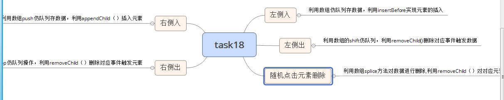

#task18
###问题分解

####需要补充的知识点
>1.children和childNodes的区别
		childNodes表示的某一元素下的节点集合，包括属性节点和文本节点等，但可通过nodeType来过滤求出元素节点
		children是非标准的，在IE下children包括注释节点，一般来说表示某一元素下的元素节点集合
		共同点：都有length属性，可以求出某一元素下的节点个数

>2、用面向对象的方式来分析问题
		在分析问题时，找出不变和可变，利用封装的思想来分析问题和解决问题

####还存在的疑惑
>1、当一个事件绑定里面包括另一个元素的事件绑定，连续触发是怎么回事
>2、函数句柄和函数调用在事件绑定中的不同