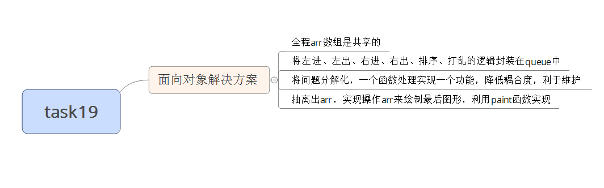

#task19
##面向对象思维分析问题

####补充的知识点
#####冒泡排序
		核心思想：利用每一次比较相邻项的大小，一次内嵌for循环，找出最大的放在数组最后一项;内嵌循环数组长度减一重复操作
#####选择排序
		核心思想：默认第一项为最小/最大项,内嵌循环中，比较相邻项大小，并将默认项索引下标变为较小/较大项；一次内嵌循环后，替换默认项的索引值。依此重复操作

		两者比较：选择排序，减少了数组项替换的次数

#####打乱一个数组的方法
		arr.sort(function(){ return 0.5-Math.random()});
		