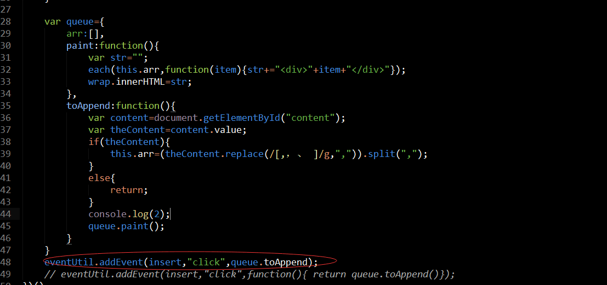

#task20
		基本思路同task18
###一个盲点
;
		注：事件绑定中绑定函数的this是当前dom元素,所以queue.toAppend的this指向的是insert这个元素。
		所以为了使this绑定的为queue对象，在函数调用外面包裹一层匿名函数，匿名函数的this是指向insert，但是匿名函数return的queue.toAppend，toAppend的this是指向queue;

