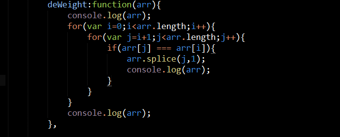
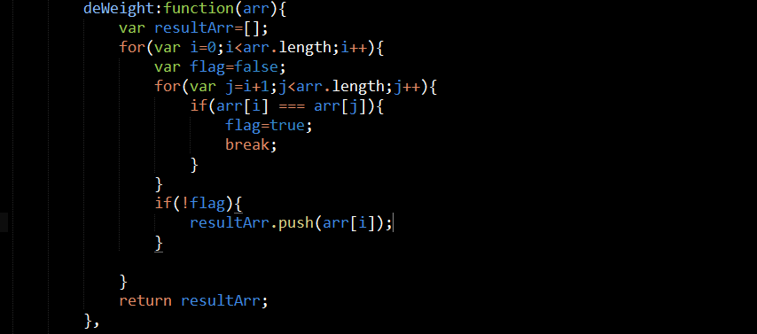

#task21
###补充的知识点
#####第一个（input事件）
		在文本框或者textarea中，input的触发是其value改变和失去焦点才会触发
		在单选框或者下拉列列表中，input的触发只需value的改变即可
#####第二个(数组去重)
		之前实现代码的错误是利用splice去除重复项时，本身会改变length，所以会影响接下来的循环
		注：关键点flag的应用，"门"的应用。
		要点：双重循环，判断“开门or关门”,新建一个数组，将一次内嵌循环比较后，不重复的压进去

#####第三个（数组内置方法使用改变原数组的方法）
		sort  
		reverse
		push
		pop
		shift
		unshift
		splice
#####第四个（隐式转换和其他类型转换布尔型）
		注：if/while中的循环条件存在隐式转换，会将其他类型隐式转换为布尔型
		隐式转换成布尔型：“”（空字符串）、0转换为Boolean为false；{}(空对象)会转成true
		强制转换成布尔型:!""、!0、!null、!undefined都会转成ture;
#####第五个（出现undefined的几种情况）
		1、变量声明，未定义，被调用
		2、使用了为传参的形参
		3、对象上不存在的属性
		4、调用一个方法，该方法无返回值
######第六个
		textContent和innerText，俩个属性都可以取到DOM节点中的文本，
		唯一区别：innerText在火狐中存在兼容，需要用textContent实现
###操作小技巧
#####第一个
		可用变量self保存对上一this在下一函数中的引用
#####第二个
		localeCompare方法，比较本地特定顺序的2个字符串，其返回值为0，大于0，小于0
		语法：string1.localCompare(string2);

###需加强的点（问题分析，面向对象方法解决问题）
