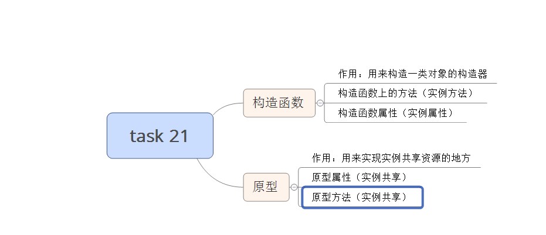

#task21
###补充的知识点
#####第一个（input事件）
		在文本框或者textarea中，input的触发是其value改变和失去焦点才会触发
		在单选框或者下拉列列表中，input的触发只需value的改变即可
#####第二个(数组去重)
		之前实现代码的错误是利用splice去除重复项时，本身会改变length，所以会影响接下来的循环
		注：关键点flag的应用，"门"的应用。
		要点：双重循环，判断“开门or关门”,新建一个数组，将一次内嵌循环比较后，不重复的压进去

#####第三个（数组内置方法使用改变原数组的方法）
		sort  
		reverse
		push
		pop
		shift
		unshift
		splice
#####第四个（隐式转换和其他类型转换布尔型）
		注：if/while中的循环条件存在隐式转换，会将其他类型隐式转换为布尔型
		隐式转换成布尔型：“”（空字符串）、0转换为Boolean为false；{}(空对象)会转成true
		强制转换成布尔型:!""、!0、!null、!undefined都会转成ture;
#####第五个（出现undefined的几种情况）
		1、变量声明，未定义，被调用
		2、使用了为传参的形参
		3、对象上不存在的属性
		4、调用一个方法，该方法无返回值
######第六个
		textContent和innerText，俩个属性都可以取到DOM节点中的文本，
		唯一区别：innerText在火狐中存在兼容，需要用textContent实现
###操作小技巧
#####第一个
		可用变量self保存对上一this在下一函数中的引用
#####第二个
		localeCompare方法，比较本地特定顺序的2个字符串，其返回值为0，大于0，小于0
		语法：string1.localCompare(string2);
#####第三个
		当后一个函数的执行依赖前一个函数的执行的结果时，可巧妙使用"||"来代替if循环语句
		在that.deRepeat函数中设定一个布尔型返回值（注:当调用一个函数无返回值时，默认为undefined）
		that.deRepeat(that.getData()) || that.render(that.getData());
###需加强的点（问题分析，面向对象方法解决问题）
#####之前的误区
		在Oldtask.js文件中，为了实现“自以为的封装”,不管三七二十一将好多方法塞给queue对象，根本没有理解对象的作用和含义
		注:在js中没有类的概念，但可以用对象或者构造函数来模拟类的某些特性，所以在封装一个对象时，对象里头的方法和属性一定是描述这个对象的状态和功能

###利用构造函数和原型创建对象解决思路

		具体代码见newtask21.js
#####总结
		在newtask21.js实现过程其，没有设置实例属性arr为一个数组，来进行之后的逻辑处理，好处在于减少渲染了节点的次数，本来可以操作wrap.children来实现功能，没必要绑定一个数组，来操作数组，最后来实现一个操作节点
#####疑惑点：
		在分析要实现的需求时，可以理解实例状态方法写在构造函数中，不必实例共享。但在实际操作中还是不能很好分析
		感觉如上例中:getData和render方法都可以在原型上实现，必要时可以加传参和if条件判断来实现，想知道这两种实现的具体区别。