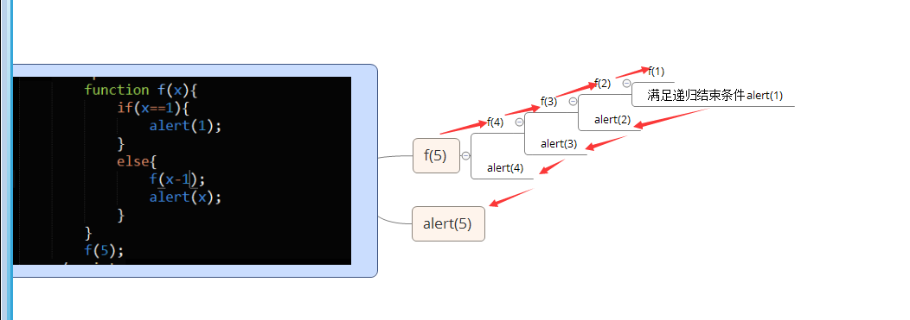

#task22
###二叉树的遍历
#####前序遍历（根左右）
		若二叉树为空，则空操作返回，否则先访问根结点，然后前序遍历左子树，再前序遍历右子树。
#####中序遍历（左根右）
		若树为空，则空操作返回，中序遍历根结点的左子树，然后是访问根结点，最后中序遍历右子树。
#####后序遍历(左右根)
		若树为空，则空操作返回，否则从左到右先叶子后结点的方式遍历访问左右子树，最后访问根结点。
###需补充的知识点（对递归的理解）

		总结：递归就是以栈的形式将要执行的函数压入栈的过程，当递归结束时，再将栈里面的函数依次出栈执行
			  而在二叉树遍历时使用的递归有多次出栈入栈的过程		
###遇到的坑
#####第一:动画函数设置
		动画要实现的效果：每隔一段时间，将数组中下一项的背景颜色变为红色。
		本来考虑到要先将之前的div的背景颜色取消，不管三七二十一用for循环遍历来取消，还把for循环放在定时器函数里面.
		但是实际情况中都是要设置数组项的当前项颜色，只需取消其前一项设置的背景颜色，没不要小题大做用for循环来取消，只需设置一个变量i;每次在定时器函数里面实现i的自增，便可操作i来实现颜色的设置
#####第二：在DOM中操作元素样式
		本来没打算用行内样式来实现背景颜色的设置，因为代码有点多。所以考虑用给元素添加class属性来设置，结果重置元素的class属性，把之前在HTML中绑定的class给覆盖掉；
		所以：如果是只单单改变元素一个样式，直接用行内样式实现就好了。

