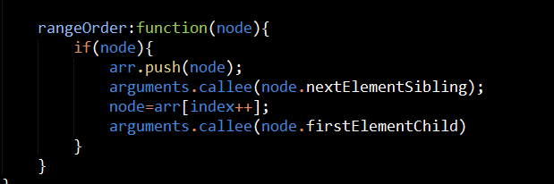

#task23
###疑惑的问题
#####关于setInterval和setTimeout
		本来想在动画执行完加其他的逻辑处理，但是好像动画是异步执行的，不影响接下来代码的执行
		setInterval是间隔调用，如间隔时间是0.5s表每隔0.5s以后将被调用的函数推送至主任务队列中
		疑惑一：是将执行结果推送至主任务队列中，其代码的执行还是在分支任务队列中执行的吗？
		疑惑二：主任务队列中代码一直往下执行，处理分支上执行结果是利用浏览器异步来处理的吗？
		疑惑三：假如我想要执行动画函数执行完以后的逻辑处理，除了加setTimeout来处理，还有其他办法吗？
###补充的知识点
#####树的广度遍历

		
		广度遍历要点：从根节点开始，一次访问其兄弟节点，然后利用index存储每个兄弟节点在数组中的位置，利用队列的特性先进先出和递归，在无兄弟节点以后依次访问队列中节点的第一个子节点

#####节点的常见属性总结
		innerText:我的理解是将获取该节点的innerHTML,然后将元素节点和属性节点等过滤，留取文本节点
				  在代码中，遇到想要获取一个父节点的文本，结果获取到这个父节点的文本和其子节点的文本
		nodeName:在元素节点中获取元素节点的元素名，大写
		nodeValue:在文本节点中获取文本节点中的文本值
#####弹性布局
		在flex-item中设置margin,和flex=1，那么flex-item会将弹性容器，扣除margin以后的长度在平分剩余长度
		在弹性容器中设置padding，也是这个道理
		在flex-item中设置flex-basis，如果该元素还设置了flex:1,那么其最后的长度会事flex-basis再加上flex:1
		平分获取到的和
		注：在理解盒子模型时，可以脑补实际盒子进行理解，好处在于不会那么抽象
###还遗留的bug
		在先进行深度遍历查找，在进行广度遍历查找，广度遍历查找就会报错 ？