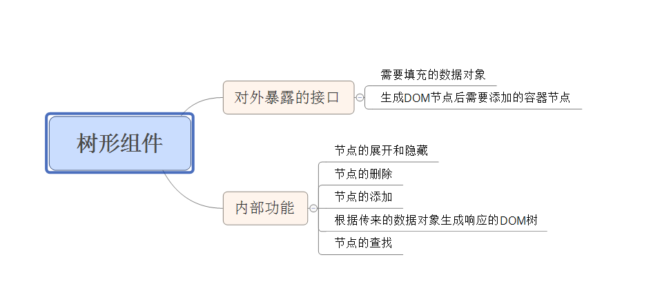
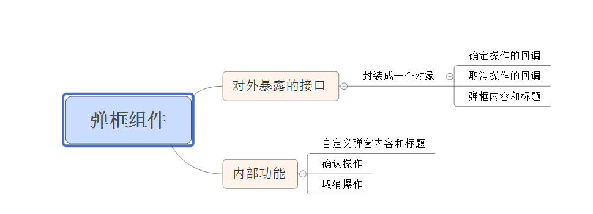

#task25树形组件
###对组件的理解
		一种可复用的交互元素的封装；内部通过API，事件实现功能的封装，对外暴露接口实现复用
###实现一个组件的流程
		第一步：分析交互意图以及需求
		第二步：实现一个静态结构，有助于创建原型，书理逻辑
		第三步：设置接口，初始化，并定义公共接口
		第四步：实现功能接口，并暴露事件
		第五步：完善阶段
####比如树形组件

####比如弹框组件

####综合上述两种，实现一个组件的思路
		利用构造函数和原型来实现一个组件，将实例属性和方法写在构造函数中，将共享方法写在原型中

####总结树形组件
#####需要补充的知识点
		第一：在sublime编译器中，对于一个字符串的解析不会换行，所以如果要实现一个字符串换行需要加转义字符“/”

		第二：在绑定事件时，如果需要在绑定函数中调用某个对象的函数，可以用bind来实现函数的调用。

		第三：利用border实现一个三角形的绘制时，一定要牢记对于一个高宽为0的元素，border是怎样分配给四边

		第四：对于事件委托的理解，事件委托是利用冒泡的原理实现的，实现的功能是不需要绑定事件在多个子元素中，可以委托给父元素来实现，可以通过target,IE(srcElement)，来实现对触发节点子元素的获取和处理。
		在事件委托中阻止冒泡，只是不让元素在事件委托元素以后在继续冒泡而已

		第五：addEventLisener可以实现对同一个元素绑定同一个元素多次，实现多次触发操作.(这就是我多次调用初始化函数，引发了多次绑定同一事件给同一个元素)
#####还存在的问题
		封装还存在问题，未做兼容性处理
#####可以完善的地方
		可以用设计模式来实现一个事件的监听处理。（存在问题：还不怎么理解设计，模式）
